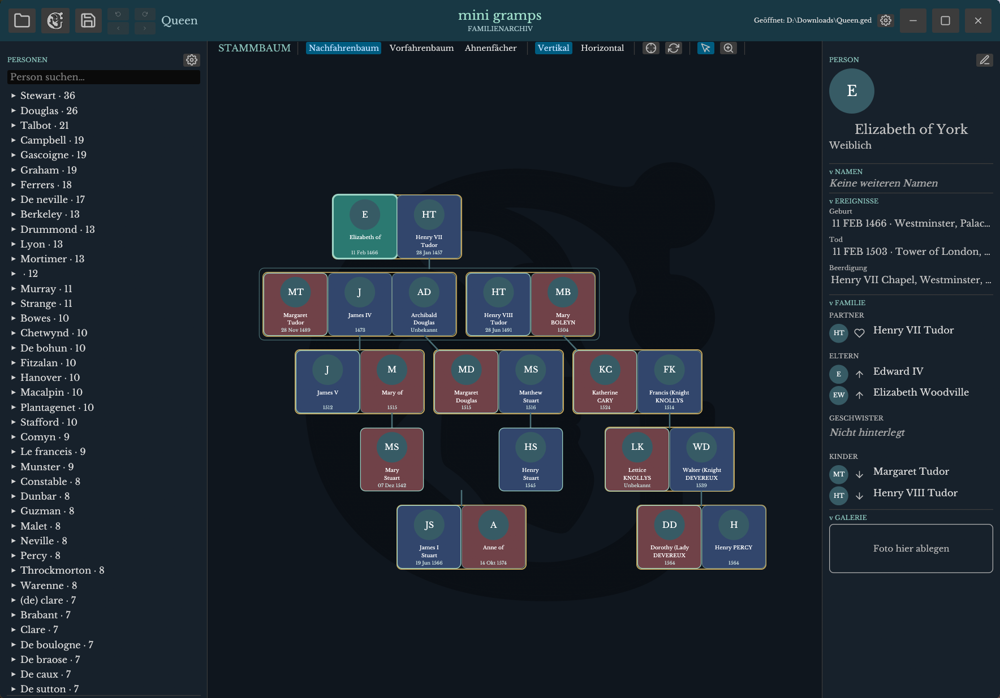

# MiniGramps



Ein modernes, schnelles Familienarchiv als native Desktop-Anwendung (Rust + egui/eframe).

[-orange?logo=rust)](https://www.rust-lang.org/)
[](https://github.com/emilk/egui)
[](#voraussetzungen)
[](#entwicklung)

MiniGramps modernisiert **Gramps**: Das mächtige, aber im Alltag oft sperrige
und langsame Programm wird in Bedienung und Tempo auf einen schlanken, schnellen
Kern gebracht – ohne den Datenbestand einzuschränken.

## Idee & Ziel

**Gramps modernisieren.** Gramps ist funktional stark, wirkt im Alltag aber
klobig: viele Dialoge, träge Listen, langsame Interaktion. MiniGramps überträgt
die **notwendigen** Funktionen in ein schlankes, reaktives Bedienkonzept – der
Datenbestand bleibt dabei vollständig.

- **Vollständige Gramps-Daten-Kompatibilität als Ziel.** Bestehende
  Gramps-Daten sollen vollständig und verlustfrei nutzbar sein (Import **und**
  Export). Das ist der Anspruch; der aktuelle Import deckt die **Kerndaten** ab
  und wird bis zur Vollständigkeit ausgebaut. Nicht jede Spezialfunktion wird
  nachgebaut, die Datenbasis aber vollständig unterstützt.
- **Vereinfachtes Bedienkonzept.** Weniger und klarere Schritte: direkt am Baum
  arbeiten, Personen und Beziehungen inline bearbeiten, Referenzperson setzen
  und per **Zurück/Vor** durch die Historie navigieren.
- **Geschwindigkeit als Teil der User Experience.** Schnelles Laden, flüssiges
  Zoomen/Schwenken und ein Layout, das auch große Bäume (900+ Personen) zügig
  darstellt. Performance ist kein Nebeneffekt, sondern ein Entwurfsziel.

Fotos werden nach dem Gramps-Prinzip als relative Pfade mit Inhalts-Hash
verwaltet; Daten liegen in einem portablen JSON-Format vor.

---

## Inhaltsverzeichnis

- [Idee & Ziel](#idee--ziel)
- [Funktionen](#funktionen)
- [Gramps-Kompatibilität](#gramps-kompatibilität)
- [Voraussetzungen](#voraussetzungen)
- [Bauen & Starten](#bauen--starten)
- [Web (WASM)](#web-wasm)
- [Android](#android)
- [Bedienung](#bedienung)
- [Datenhaltung & Speicherorte](#datenhaltung--speicherorte)
- [Import](#import)
- [Datums- und Namenskonventionen](#datums--und-namenskonventionen)
- [Konfiguration](#konfiguration)
- [Projektstruktur](#projektstruktur)
- [Entwicklung](#entwicklung)
- [Lizenz](#lizenz)

---

## Funktionen

**Baumansichten**

- Nachfahrenbaum, Vorfahrenbaum und Ahnenfächer
- Ausrichtung **vertikal** oder **horizontal**
- Kartenlayouts **Kompakt** (mit rundem Avatar) und **Großes Foto** (Porträtkarte)
- Übersichtliche Karten bei kleinem Zoom (Profilbild bzw. Initialen), vollständige
  Details ab einer Zoom-Schwelle
- Automatisches Layout mit Überschneidungsauflösung; einstellbarer Baum-Abstand
  (Default) und fester Mindestabstand zwischen Karten

**Interaktion am Baum**

- Zoom auf die Mauszeigerposition (Mausrad), Schwenken per Ziehen
- Karten/Zweige per **Umschalt+Ziehen** frei verschieben; Layout wird live gesichert
- **Partner-Tausch** per Zieh-Geste (nur freie Partner; datierte bleiben chronologisch)
- Karte als **Referenzperson** setzen; **Zurück/Vor**-Navigation durch die Referenz-Historie
- **Rückgängig/Wiederholen** über die Snapshot-Historie (Strg+Z / Strg+Y)

**Personen & Beziehungen**

- Personenliste links, nach Nachnamen gruppiert, mit **Suche/Filter** und
  Sortierung nach Gruppengröße oder Alphabet (Flyout am Zahnrad)
- Profilansicht rechts mit Stammdaten, Namen, Ereignissen, Familie und Galerie
- Beziehungen: Partner, Eltern, Geschwister, Kinder – inkl. Kindesart
  (leiblich, adoptiert, Stief-, Pflegekind)
- Inline- und Modal-Bearbeitung, Beziehungspicker, Erstellen neuer Personen

**Medien**

- Fotos als relative Pfade unter `<Datenordner>/media` mit Inhalts-Hash als Dateiname
- Galerie je Person, Drag-and-drop-Import, Vollbild-Lichtbox mit asynchroner Dekodierung
- Bereinigung verwaister Medien beim Speichern (Garbage Collection)

**Persistenz**

- Globale, projektübergreifende Einstellungen (Theme, Generationen, Layout, Sortierung)
- Pro Projekt: Layout-Versätze **und** zuletzt aktive Referenzperson
- Letzte Sitzung wird beim Start wiederhergestellt
- Optionales Server-Projekt (HTTP) mit lokalem Offline-Cache

**Darstellung**

- Hell/Dunkel-Theme mit eigener Farbwelt
- Datumsnormierung und Rufnamen-Regel auf den Baumkarten (siehe unten)

---

## Gramps-Kompatibilität

**Erklärtes Ziel: vollständige Gramps-Daten-Kompatibilität.** Bestehende
Gramps-Daten sollen vollständig gelesen und verlustfrei weiterverwendbar sein
(Import **und** Export). Nicht jede Spezialfunktion wird nachgebaut, die
Datenbasis aber vollständig unterstützt. Das ist der Anspruch – der Ist-Stand
ist auf dem Weg dorthin:

- **Ziel (vollständig):** alle Namensbestandteile (Rufname, Präfix/Suffix,
  Titel, mehrere Namen), Kindesart (leiblich, adoptiert, Stief-, Pflegekind),
  Quellen/Zitate, Notizen, Medien/Galerie, Attribute/Tags, Orts-Objekte sowie
  Export nach GEDCOM und Gramps-XML.
- **Bereits importiert:** Personen (Vor-/Nachname, Geschlecht), Familien
  (Vater, Mutter, Kinder) und Ereignisse mit Datum, Ort und Beschreibung.
- **Export:** noch nicht implementiert (gespeichert wird im MiniGramps-JSON);
  GEDCOM-/Gramps-XML-Export gehört zum Ziel.

Die Reihenfolge im [Roadmap](todo.md) priorisiert dieses Ziel.

---

## Voraussetzungen

- **Rust** mit Edition-2024-Unterstützung (Rust **1.85+**)
- Empfohlen: aktueller stabiler Toolchain (`rustup update stable`)
- Linux zusätzlich: die üblichen egui/winit-Systempakete (X11/Wayland, Vulkan/OpenGL)

```sh
rustc --version   # 1.85 oder neuer
cargo --version
```

---

## Bauen & Starten

```sh
# Debug
cargo run

# Optimiert (empfohlen)
cargo run --release
```

Beim ersten Start wird ein Beispielbaum geladen. Zuletzt geöffnete Projekte werden
automatisch wiederhergestellt.

---

## Web (WASM)

Der Kern ist plattformneutral; plattformspezifische Teile sind zur Kompilierzeit
ausgeblendet. Für einen ersten Web-Build:

```sh
rustup target add wasm32-unknown-unknown
cargo install trunk
trunk serve
```

Der Web-Einstieg startet derzeit mit In-Memory-Beispieldaten.

## Android

Der Android-Zielpfad ist vorbereitet (eigener `main`-Eintrag), der native Runner,
Speicher und Datei-/Medien-Picker sind noch umzusetzen.

---

## Bedienung

| Aktion | Eingabe |
| --- | --- |
| Person öffnen | Klick auf eine Karte oder Listeneintrag |
| Referenzperson setzen | Doppelklick, Umschalt+Klick oder langer Touch |
| Baum schwenken | Linke Maustaste ziehen (Werkzeug „Cursor") |
| Karte/Zweig verschieben | **Umschalt** + Ziehen |
| Partner tauschen | Ziehen zweier Partnerkarten über die Achse |
| Zoomen | Mausrad (zentriert auf den Zeiger) |
| Ansicht einpassen | Fadenkreuz-Icon in der Werkzeugleiste |
| Layout zurücksetzen | Kreispfeil-Icon (löscht manuelle Verschiebungen) |
| Rückgängig / Wiederholen | `Strg+Z` / `Strg+Y` (bzw. `Strg+Umschalt+Z`) |
| Personensuche | Suchfeld oben in der linken Leiste |
| Layout-Diagnose | `F9` (mit gesetztem `RUST_LOG`, siehe unten) |

---

## Datenhaltung & Speicherorte

Der Standard-Datenordner wird über die Betriebssystem-Pfade bestimmt
(`directories`-Crate), unter Windows z. B.:

```text
%LOCALAPPDATA%\minigramps\MiniGramps\data
```

| Datei / Ordner | Zweck |
| --- | --- |
| `familienbaum.minigramps.json` | Projektdatei (portables JSON) |
| `<projekt>.layout.json` | Manuelle Layout-Versätze **und** Referenzperson |
| `settings.json` | Globale, projektübergreifende Einstellungen |
| `letzte-sitzung.json` | Zuletzt geöffnetes Projekt |
| `media/<hash>.<ext>` | Fotos/Medien (Inhalts-Hash als Dateiname) |
| `server-cache/<url>/` | Offline-Kopie eines Server-Projekts |

---

## Import

MiniGramps liest bestehende Stammbäume ein:

- **GEDCOM** – `.ged`, `.gedcom`
- **Gramps XML** – `.gramps`, `.xml`
- **MiniGramps JSON** – `*.minigramps.json`
- **GZIP-Sicherungen** der obigen Formate

Die Formate werden automatisch erkannt; die Projektliste findet Dateien im
MiniGramps-Datenordner und im Gramps-Dokumentenordner.

---

## Datums- und Namenskonventionen

**Datum.** Auf den Baumkarten werden Datumsangaben normiert dargestellt:

- vollständige Daten als `DD Mnt YYYY` (z. B. `29 Feb 1876`; deutsche Monatskürzel
  `Jan … Dez`, `Mär` für März), auch aus `29.02.1876` oder `1876-02-29`
- Monat + Jahr als `Mnt YYYY`
- reine Jahres- und ungefähre Angaben (z. B. `1876`, `um 1850`) bleiben unverändert,
  damit keine Information verloren geht
- leere Angabe → `Unbekannt`

**Name.** Ist ein **Rufname** hinterlegt, zeigt die Karte den ersten vom Rufnamen
abweichenden Vornamen, den Rufnamen und den Nachnamen (z. B. Vornamen
„Jürgen Hans" mit Rufname „Jürgen" → „Hans Jürgen Nachname"). Gibt es keinen
abweichenden Vornamen, wird nur der Rufname geführt. Ohne Rufnamen werden die
ersten beiden Vornamen und der Nachname angezeigt.

---

## Konfiguration

`settings.json` (global) – Beispiel:

```json
{
  "dark_mode": true,
  "max_generations": 5,
  "group_by_count": true,
  "layout_gap": 48.0,
  "card_layout": "Compact",
  "tree_orientation": "Vertical"
}
```

| Feld | Bedeutung |
| --- | --- |
| `dark_mode` | Dunkles bzw. helles Theme |
| `max_generations` | Sichtbares Generationenlimit (`0` = alle) |
| `group_by_count` | Personenliste nach Gruppengröße (`true`) oder Alphabet (`false`) |
| `layout_gap` | Default-Baumabstand in der Automatik (30–150) |
| `card_layout` | `Compact` oder `Portrait` |
| `tree_orientation` | `Vertical` oder `Horizontal` |

Änderungen werden automatisch erkannt und sofort zurückgeschrieben.

---

## Projektstruktur

| Pfad | Inhalt |
| --- | --- |
| `src/main.rs` | Programmeinstieg, plattformspezifische `main`-Funktionen |
| `src/model.rs` | Datenmodell (`TreeData`, `Person`, `Family`), Verwandtschaftslogik, Datums-/Namensregeln |
| `src/import.rs` | Laden/Parsen (GEDCOM, Gramps-XML, JSON, GZIP), Projektordner, letzte Sitzung |
| `src/media.rs` | Foto-/Medienverwaltung (relative Pfade, Hashes, Texturen) |
| `src/store.rs` | `DataStore` (Dateisystem/Server), Layout-Serialisierung |
| `src/settings.rs` | Globale Einstellungen |
| `src/ui/mod.rs` | App-Zustand (`MiniGramps`), Panels, Icons, Fenster-Setup |
| `src/ui/tree.rs` | Baumlayout und Zeichnung |
| `src/ui/sidebar.rs` | Personenliste (links) und Profil (rechts) |
| `src/ui/header.rs` | Rahmenlose Titelleiste |
| `src/ui/dialogs.rs` | Dialoge (Öffnen, Einstellungen, Editor, Lichtbox, …) |
| `src/ui/picker.rs` | Beziehungspicker und Profil-Widgets |
| `src/ui/panels.rs` | Farbwelten/Paletten |

---

## Entwicklung

```sh
cargo check            # schneller Kompiliercheck
cargo test             # Unit-Tests (21)
cargo check --release  # Release-Kompiliercheck
cargo fmt              # Formatierung
cargo clippy           # Lints
```

**Logging.** Die App nutzt die `log`-Crate mit [`env_logger`](https://docs.rs/env_logger).
Standardmäßig erscheinen die App-Meldungen (`info`); die ausführliche
Layout-Diagnose läuft auf `debug` und ist abschaltbar:

```sh
# PowerShell
$env:RUST_LOG="minigramps=debug"; cargo run --release

# Bash
RUST_LOG=minigramps=debug cargo run --release
```

Ein Layout-Dump lässt sich im laufenden Betrieb mit `F9` auslösen.

---

## Lizenz

Derzeit ist **keine Lizenz** hinterlegt. Ohne eine Lizenzdatei gelten alle Rechte
vorbehalten. Für eine Weitergabe/Beiträge sollte eine Lizenz (z. B. MIT oder
Apache-2.0) ergänzt werden.
